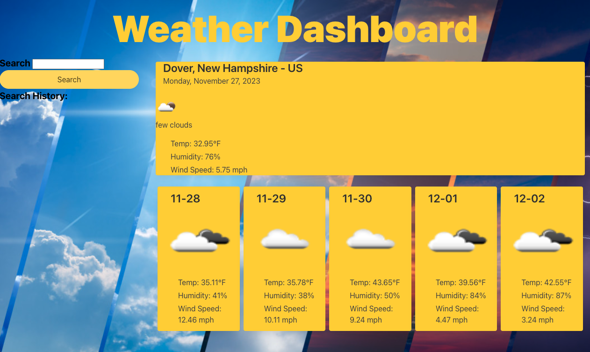
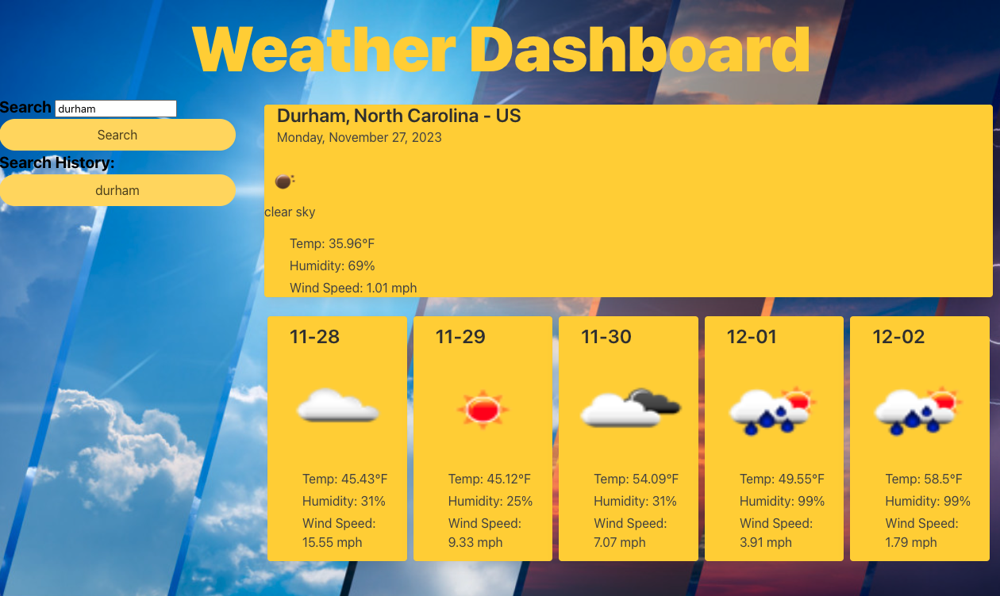
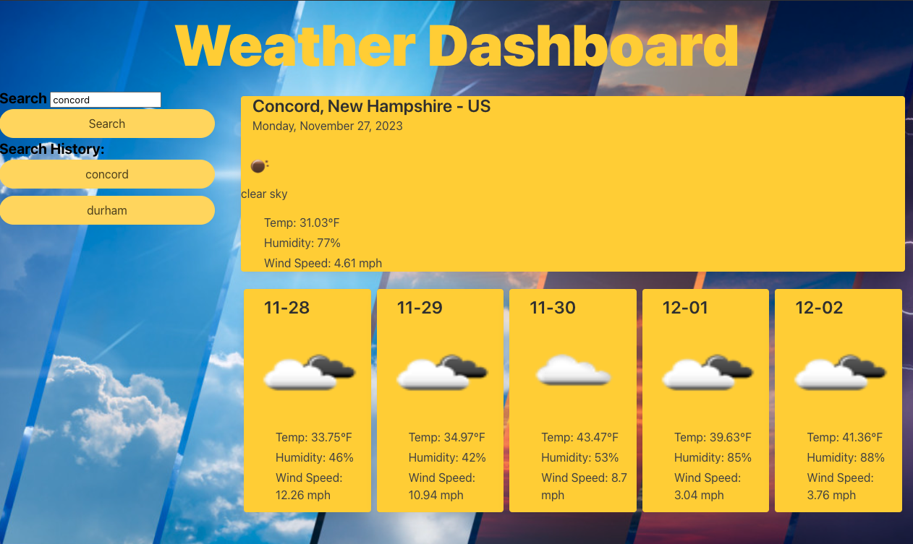

# OpenWeatherAPI-Dashboard

## Description

The purpose of the application is to allow travelers to see the weather outlook for multiple cities. On page load, weather data will load based on your current browser location. The current day will display the city name, state, country, current date, icon representing the current weather conditions, the temperature and the humidity. The five day forecast will display the date, an icon representing future weather conditions, temperature, wind speed, and himidity.

My deployed application can be found [here](https://conartisttt.github.io/OpenWeatherAPI-Dashboard/)

## Features

* Dynamically updated HTML & CSS, powered by JavaScript
* Bulma
* Use of localStorage

The following screenshots demonstrate the applications functionality:

## Technologies Used

* HTML
* CSS
* JavaScript
* Bulma
* OpenWeather API
* Dayjs

## Credits

* All code written by Conner Martin aka Conartisttt